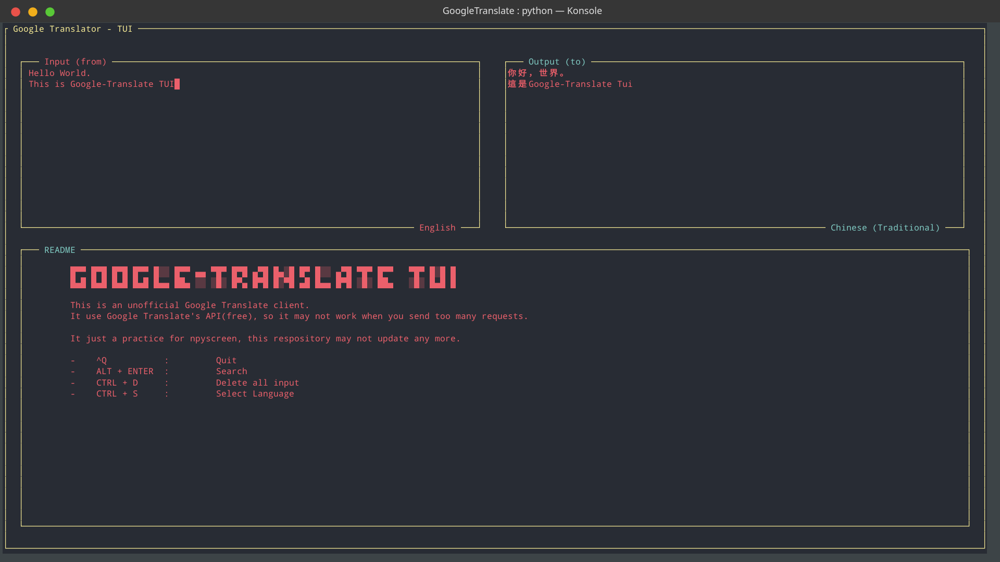

# GoogleTranslate-TUI

Google Translate client on your console (Unofficial)



## Warning

It use Google Translate's API(free), so it may not work when you send too many requests.

**It just a practice for npyscreen, this respository may not update any more.**

## Usage
- Install packages
    - `pip install -r requirements.txt`

- Change Language Settings: `vim config.json`
    - You can find Language Code in [ISO-639-1](https://en.wikipedia.org/wiki/ISO_639-1) or [Google Support](https://cloud.google.com/translate/docs/languages) or `LanguageCode.csv`
    ```
        {
            "inputLanguage": "en",
            "outputLanguage": "zh-TW"
        }
    ```

- Start
    - `python main.py`

## Controls

- Send Request: `ALT + ENTER`
- Delete all input: `CTRL + D`
- Exit: `Ctrl + Q`
- Select Language: `Ctrl + S`
    - Select other Widget: `TAB`/`Shift+TAB`
    - Select: `ENTER`
- Play Sound on left: `CTRL + K`
- Play Sound on right: `CTRL + L`
